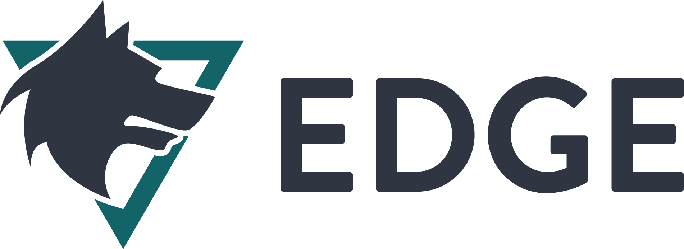

# Edge Platform [![Sponsored by][sponsor-img]][sponsor] [![lerna][lerna-img]][lerna] [![Build Status Unix][travis-img]][travis] [![Build Status Windows][appveyor-img]][appveyor]

*🐺 Edge Platform* helps you focus on business logic rather than dealing with complex dependencies and build configurations.

[sponsor-img]: https://img.shields.io/badge/Sponsored%20by-Sebastian%20Software-692446.svg
[sponsor]: https://www.sebastian-software.de
[lerna-img]: https://img.shields.io/badge/Maintained%20with-Lerna-cc00ff.svg
[lerna]: https://lernajs.io/
[travis-img]: https://img.shields.io/travis/sebastian-software/edge/master.svg?branch=master&label=unix
[appveyor-img]: https://img.shields.io/appveyor/ci/swernerx/edge/master.svg?label=windows
[travis]: https://travis-ci.org/sebastian-software/edge
[appveyor]: https://ci.appveyor.com/project/swernerx/edge/branch/master

## *🐺 Edge Platform* Components

> "Understanding the architectural decisions behind the tools you are using is perhaps more important than the many things a new package does for you." — James Gillmore

Project Name | NPM Status | Dependency Status
------------ | ---------- | -------------------------------------
[Edge Common][common-home] | [![Version][common-npm-version-img]][common-npm] [![Downloads][common-npm-downloads-img]][common-npm] | [![Dependencies][common-deps-img]][common-deps]
[Edge Builder][builder-home] | [![Version][builder-npm-version-img]][builder-npm] [![Downloads][builder-npm-downloads-img]][builder-npm] | [![Dependencies][builder-deps-img]][builder-deps]
[Edge Core][core-home] | [![Version][core-npm-version-img]][core-npm] [![Downloads][core-npm-downloads-img]][core-npm] | [![Dependencies][core-deps-img]][core-deps]
[Edge Style][style-home] | [![Version][style-npm-version-img]][style-npm] [![Downloads][style-npm-downloads-img]][style-npm] | [![Dependencies][style-deps-img]][style-deps]
[Edge Express][express-home] | [![Version][express-npm-version-img]][express-npm] [![Downloads][express-npm-downloads-img]][express-npm] | [![Dependencies][express-deps-img]][express-deps]
[Edge UserAgent][useragent-home] | [![Version][useragent-npm-version-img]][useragent-npm] [![Downloads][useragent-npm-downloads-img]][useragent-npm] | [![Dependencies][useragent-deps-img]][useragent-deps]
[Edge Boilerplate][boilerplate-home] | [![Version][boilerplate-npm-version-img]][boilerplate-npm] [![Downloads][boilerplate-npm-downloads-img]][boilerplate-npm] | [![Dependencies][boilerplate-deps-img]][boilerplate-deps]
[Edge PostCSS][postcss-home] | [![Version][postcss-npm-version-img]][postcss-npm] [![Downloads][postcss-npm-downloads-img]][postcss-npm] | [![Dependencies][postcss-deps-img]][postcss-deps]

## *🐺 Edge Platform* Foundation Technologies

Project Name | NPM Status | Build Status | Dependency Status
------------ | ---------- | ------------ | -------------------------------------
[Edge Babel][babel-home] | [![Version][babel-npm-version-img]][babel-npm] [![Downloads][babel-npm-downloads-img]][babel-npm] | [![Build Status Unix][babel-travis-img]][babel-travis] [![Build Status Windows][babel-appveyor-img]][babel-appveyor] | [![Dependencies][babel-deps-img]][babel-deps]
[Lean Intl][intl-home] | [![Version][intl-npm-version-img]][intl-npm] [![Downloads][intl-npm-downloads-img]][intl-npm] | [![Build Status Unix][intl-travis-img]][intl-travis] [![Build Status Windows][intl-appveyor-img]][intl-appveyor] | [![Dependencies][intl-deps-img]][intl-deps]
[Prepublish][prepublish-home] | [![Version][prepublish-npm-version-img]][prepublish-npm] [![Downloads][prepublish-npm-downloads-img]][prepublish-npm] | [![Build Status Unix][prepublish-travis-img]][prepublish-travis] [![Build Status Windows][prepublish-appveyor-img]][prepublish-appveyor] | [![Dependencies][prepublish-deps-img]][prepublish-deps]
[Readable CLI][readable-home] | [![Version][readable-npm-version-img]][readable-npm] [![Downloads][readable-npm-downloads-img]][readable-npm] | - | [![Dependencies][readable-deps-img]][readable-deps]
[PostCSS Smart Asset][smartasset-home] | [![Version][smartasset-npm-version-img]][smartasset-npm] [![Downloads][smartasset-npm-downloads-img]][smartasset-npm] | [![Build Status Unix][smartasset-travis-img]][smartasset-travis] [![Build Status Windows][smartasset-appveyor-img]][smartasset-appveyor] | [![Dependencies][smartasset-deps-img]][smartasset-deps]
[Rollup Rebase][rebase-home] | [![Version][rebase-npm-version-img]][rebase-npm] [![Downloads][rebase-npm-downloads-img]][rebase-npm] | [![Build Status Unix][rebase-travis-img]][rebase-travis] [![Build Status Windows][rebase-appveyor-img]][rebase-appveyor] | [![Dependencies][rebase-deps-img]][rebase-deps]

[common-home]: https://github.com/sebastian-software/edge/tree/master/packages/edge-common
[common-deps]: https://david-dm.org/sebastian-software/edge?path=packages/edge-common
[common-deps-img]: https://david-dm.org/sebastian-software/edge.svg?path=packages/edge-common
[common-npm]: https://www.npmjs.com/package/edge-common
[common-npm-downloads-img]: https://img.shields.io/npm/dm/edge-common.svg
[common-npm-version-img]: https://img.shields.io/npm/v/edge-common.svg

[builder-home]: https://github.com/sebastian-software/edge/tree/master/packages/edge-builder
[builder-deps]: https://david-dm.org/sebastian-software/edge?path=packages/edge-builder
[builder-deps-img]: https://david-dm.org/sebastian-software/edge.svg?path=packages/edge-builder
[builder-npm]: https://www.npmjs.com/package/edge-builder
[builder-npm-downloads-img]: https://img.shields.io/npm/dm/edge-builder.svg
[builder-npm-version-img]: https://img.shields.io/npm/v/edge-builder.svg

[core-home]: https://github.com/sebastian-software/edge/tree/master/packages/edge-core
[core-deps]: https://david-dm.org/sebastian-software/edge?path=packages/edge-core
[core-deps-img]: https://david-dm.org/sebastian-software/edge.svg?path=packages/edge-core
[core-npm]: https://www.npmjs.com/package/edge-core
[core-npm-downloads-img]: https://img.shields.io/npm/dm/edge-core.svg
[core-npm-version-img]: https://img.shields.io/npm/v/edge-core.svg

[style-home]: https://github.com/sebastian-software/edge/tree/master/packages/edge-style
[style-deps]: https://david-dm.org/sebastian-software/edge?path=packages/edge-style
[style-deps-img]: https://david-dm.org/sebastian-software/edge.svg?path=packages/edge-style
[style-npm]: https://www.npmjs.com/package/edge-style
[style-npm-downloads-img]: https://img.shields.io/npm/dm/edge-style.svg
[style-npm-version-img]: https://img.shields.io/npm/v/edge-style.svg

[express-home]: https://github.com/sebastian-software/edge/tree/master/packages/edge-express
[express-deps]: https://david-dm.org/sebastian-software/edge?path=packages/edge-express
[express-deps-img]: https://david-dm.org/sebastian-software/edge.svg?path=packages/edge-express
[express-npm]: https://www.npmjs.com/package/edge-express
[express-npm-downloads-img]: https://img.shields.io/npm/dm/edge-express.svg
[express-npm-version-img]: https://img.shields.io/npm/v/edge-express.svg

[useragent-home]: https://github.com/sebastian-software/edge/tree/master/packages/edge-useragent
[useragent-deps]: https://david-dm.org/sebastian-software/edge?path=packages/edge-useragent
[useragent-deps-img]: https://david-dm.org/sebastian-software/edge.svg?path=packages/edge-useragent
[useragent-npm]: https://www.npmjs.com/package/edge-useragent
[useragent-npm-downloads-img]: https://img.shields.io/npm/dm/edge-useragent.svg
[useragent-npm-version-img]: https://img.shields.io/npm/v/edge-useragent.svg

[boilerplate-home]: https://github.com/sebastian-software/edge/tree/master/packages/edge-boilerplate
[boilerplate-deps]: https://david-dm.org/sebastian-software/edge?path=packages/edge-boilerplate
[boilerplate-deps-img]: https://david-dm.org/sebastian-software/edge.svg?path=packages/edge-boilerplate
[boilerplate-npm]: https://www.npmjs.com/package/edge-boilerplate
[boilerplate-npm-downloads-img]: https://img.shields.io/npm/dm/edge-boilerplate.svg
[boilerplate-npm-version-img]: https://img.shields.io/npm/v/edge-boilerplate.svg

[postcss-home]: https://github.com/sebastian-software/edge/tree/master/packages/edge-postcss
[postcss-deps]: https://david-dm.org/sebastian-software/edge?path=packages/edge-postcss
[postcss-deps-img]: https://david-dm.org/sebastian-software/edge.svg?path=packages/edge-postcss
[postcss-npm]: https://www.npmjs.com/package/edge-postcss
[postcss-npm-downloads-img]: https://img.shields.io/npm/dm/edge-postcss.svg
[postcss-npm-version-img]: https://img.shields.io/npm/v/edge-postcss.svg

[babel-home]: https://github.com/sebastian-software/babel-preset-edge
[babel-deps]: https://david-dm.org/sebastian-software/babel-preset-edge
[babel-deps-img]: https://david-dm.org/sebastian-software/babel-preset-edge.svg
[babel-npm]: https://www.npmjs.com/package/babel-preset-edge
[babel-npm-downloads-img]: https://img.shields.io/npm/dm/babel-preset-edge.svg
[babel-npm-version-img]: https://img.shields.io/npm/v/babel-preset-edge.svg
[babel-travis-img]: https://img.shields.io/travis/sebastian-software/babel-preset-edge/master.svg?branch=master&label=unix
[babel-appveyor-img]: https://img.shields.io/appveyor/ci/swernerx/babel-preset-edge/master.svg?label=windows
[babel-travis]: https://travis-ci.org/sebastian-software/babel-preset-edge
[babel-appveyor]: https://ci.appveyor.com/project/swernerx/babel-preset-edge/branch/master

[intl-home]: https://github.com/sebastian-software/lean-intl
[intl-deps]: https://david-dm.org/sebastian-software/lean-intl
[intl-deps-img]: https://david-dm.org/sebastian-software/lean-intl.svg
[intl-npm]: https://www.npmjs.com/package/lean-intl
[intl-npm-downloads-img]: https://img.shields.io/npm/dm/lean-intl.svg
[intl-npm-version-img]: https://img.shields.io/npm/v/lean-intl.svg
[intl-travis-img]: https://img.shields.io/travis/sebastian-software/lean-intl/master.svg?branch=master&label=unix
[intl-appveyor-img]: https://img.shields.io/appveyor/ci/swernerx/lean-intl/master.svg?label=windows
[intl-travis]: https://travis-ci.org/sebastian-software/lean-intl
[intl-appveyor]: https://ci.appveyor.com/project/swernerx/lean-intl/branch/master

[prepublish-home]: https://github.com/sebastian-software/prepublish
[prepublish-deps]: https://david-dm.org/sebastian-software/prepublish
[prepublish-deps-img]: https://david-dm.org/sebastian-software/prepublish.svg
[prepublish-npm]: https://www.npmjs.com/package/prepublish
[prepublish-npm-downloads-img]: https://img.shields.io/npm/dm/prepublish.svg
[prepublish-npm-version-img]: https://img.shields.io/npm/v/prepublish.svg
[prepublish-travis-img]: https://img.shields.io/travis/sebastian-software/prepublish/master.svg?branch=master&label=unix
[prepublish-appveyor-img]: https://img.shields.io/appveyor/ci/swernerx/prepublish/master.svg?label=windows
[prepublish-travis]: https://travis-ci.org/sebastian-software/prepublish
[prepublish-appveyor]: https://ci.appveyor.com/project/swernerx/prepublish/branch/master

[readable-home]: https://github.com/sebastian-software/readable-cli
[readable-deps]: https://david-dm.org/sebastian-software/readable-cli
[readable-deps-img]: https://david-dm.org/sebastian-software/readable-cli.svg
[readable-npm]: https://www.npmjs.com/package/readable-cli
[readable-npm-downloads-img]: https://img.shields.io/npm/dm/readable-cli.svg
[readable-npm-version-img]: https://img.shields.io/npm/v/readable-cli.svg
[readable-travis-img]: https://img.shields.io/travis/sebastian-software/readable-cli/master.svg?branch=master&label=unix
[readable-appveyor-img]: https://img.shields.io/appveyor/ci/swernerx/readable-cli/master.svg?label=windows
[readable-travis]: https://travis-ci.org/sebastian-software/readable-cli
[readable-appveyor]: https://ci.appveyor.com/project/swernerx/readable-cli/branch/master

[smartasset-home]: https://github.com/sebastian-software/postcss-smart-asset
[smartasset-deps]: https://david-dm.org/sebastian-software/postcss-smart-asset
[smartasset-deps-img]: https://david-dm.org/sebastian-software/postcss-smart-asset.svg
[smartasset-npm]: https://www.npmjs.com/package/postcss-smart-asset
[smartasset-npm-downloads-img]: https://img.shields.io/npm/dm/postcss-smart-asset.svg
[smartasset-npm-version-img]: https://img.shields.io/npm/v/postcss-smart-asset.svg
[smartasset-travis-img]: https://img.shields.io/travis/sebastian-software/postcss-smart-asset/master.svg?branch=master&label=unix
[smartasset-appveyor-img]: https://img.shields.io/appveyor/ci/swernerx/postcss-smart-asset/master.svg?label=windows
[smartasset-travis]: https://travis-ci.org/sebastian-software/postcss-smart-asset
[smartasset-appveyor]: https://ci.appveyor.com/project/swernerx/postcss-smart-asset/branch/master

[rebase-home]: https://github.com/sebastian-software/rollup-plugin-rebase
[rebase-deps]: https://david-dm.org/sebastian-software/rollup-plugin-rebase
[rebase-deps-img]: https://david-dm.org/sebastian-software/rollup-plugin-rebase.svg
[rebase-npm]: https://www.npmjs.com/package/rollup-plugin-rebase
[rebase-npm-downloads-img]: https://img.shields.io/npm/dm/rollup-plugin-rebase.svg
[rebase-npm-version-img]: https://img.shields.io/npm/v/rollup-plugin-rebase.svg
[rebase-travis-img]: https://img.shields.io/travis/sebastian-software/rollup-plugin-rebase/master.svg?branch=master&label=unix
[rebase-appveyor-img]: https://img.shields.io/appveyor/ci/swernerx/rollup-plugin-rebase/master.svg?label=windows
[rebase-travis]: https://travis-ci.org/sebastian-software/rollup-plugin-rebase
[rebase-appveyor]: https://ci.appveyor.com/project/swernerx/rollup-plugin-rebase/branch/master

## Core Technologies

### Tooling

- Webpack: Bundling for SPAs.
  - Loaders: Assets, JSON, YAML, GraphQL, ...
  - Plugins:
- Rollup: Bundling for Libraries and Executables.
- PostCSS: CSS Transformation Chain.
  - CSS Modules enabled.
- ESLint: Linting for JavaScript files.
  - Plugins for React, Security, Imports, ...
- Stylelint: Linting for CSS files.
- Prettier: Autoformatting for JavaScript, CSS, JSON, GraphQL and more.
- Uglify-ES: ES2015 capable JavaScript compression
- Babili: ES2015+ capable JavaScript compression
- Zopfli: Highly optimized Compression of Resources

### React Development

- React: Core UI View Library
- Redux: State Container with great developer experience
- Apollo Client: Connect to GraphQL endpoints
- Universal Component: Dynamically load chunks
- Lean Intl: Alternative to Intl Polyfill
- CSS Modules: Sandboxed Component-centric Styles

### Server

- Express: Effectively the standard Web Server in NodeJS
- Cookie Parser:
- Express Locale: Locale Detection
- Helmet:
- HPP

### Helpers

- AppRootDir: Detect of project root directory
- Webpack Hot Server Middleware: Multi Compiler Infrastructure for our Development Server
- React Dev Utils: Collection of Libraries from Facebook to improve DX in React Development

## License

[Apache License Version 2.0, January 2004](license)

## Copyright

Copyright 2015-2017 [Sebastian Software GmbH](http://www.sebastian-software.de)
